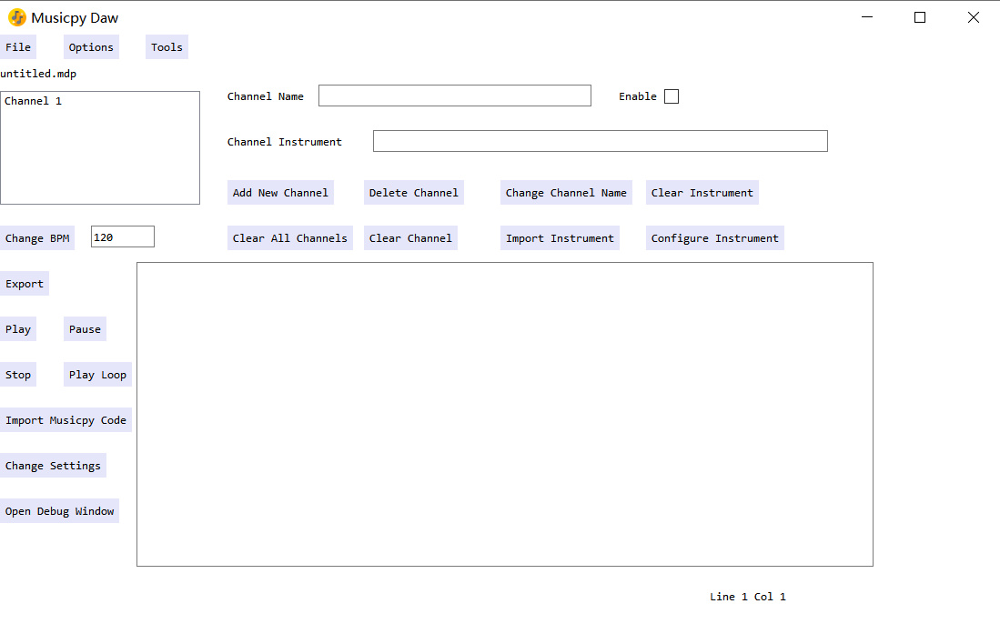
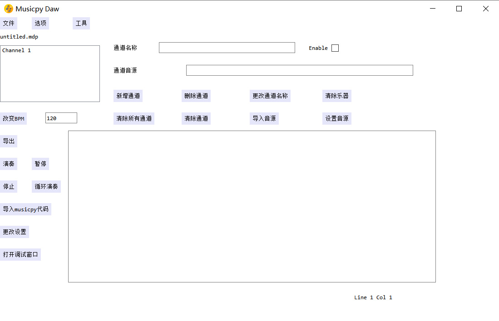

# musicpy daw

[English] [[中文](#musicpy-daw-1)]

This is a plaintext daw to make music with [musicpy](https://github.com/Rainbow-Dreamer/musicpy).


## Functionality

* Generate audio to play or export with musicpy codes
* Load audio files, SoundFont files, python scripts as instruments
* Load python scripts, VST3 plugins as effect plugins
* Work with other python audio processing or math and statistics libraries
* Save current project as a project file
* Generate basic waveforms and make new waveforms by applying custom functions
* Support mixer for master and each channel where you can load effect plugins
* Export musicpy codes to audio files, support wav, mp3, ogg and other audio formats that are supported by ffmpeg
* Debug window for showing error messages
* Built-in pitch shifter to make pitch changes to audio files
* Support multiple languages
* Support skin customization
* Save current instrument parameters as a preset file to load in another project


## Previews




## Download

You can download the latest version of musicpy daw from [here](https://www.jianguoyun.com/p/DeTfvFAQt43aDBitycoFIAA)


## Usage

You can write any musicpy codes inside the input text area.

To play or export a musicpy data structure, like note, chord, track and piece, there are 2 ways to write in the input text area.

1. Write musicpy codes to get the resulted musicpy data structures you want to play or export, but you need to follow the syntax
   ```python
   play [musicpy data structure], bpm, channel_number
   ```
   to set the current music object to be play or export.

   When you run the code or click the play button, it will play the musicpy data structures, when you click the export button to export, it will export the musicpy data structures as audio files.

   The BPM and channel number could be omitted, if the BPM is omitted, the daw will use default BPM, if the channel number is omitted, the daw will use channel number 1.

   Note that channel number is 1-based.

   Here is an example:

   ```python
   part1 = C('Cmaj7') % (1, 1/8) * 2
   part2 = C('Am7') % (1, 1/8) * 2
   result = part1 | part2
   play result
   # with BPM and channel number: play result, 150, 1
   ```

2. You can also use `play` and `export` function that takes essentially the same parameters as the `play` and `export` function of the daw in musicpy daw module, which supports more parameters for more customized play and export requirements.  For the usage of `play` and `export` function, you can refer to the documentation of musicpy daw module, I will give the link below.

   ```python
   play(current_chord,
        bpm=None,
        channel=1,
        length=None,
        extra_length=None,
        track_lengths=None,
        track_extra_lengths=None,
        soundfont_args=None)
   
   export(current_chord,
          mode='wav',
          action='export',
          channel=1,
          bpm=None,
          length=None,
          extra_length=None,
          track_lengths=None,
          track_extra_lengths=None,
          export_args={},
          soundfont_args=None,
          write_args={})
   ```

The input text area can accept any python codes, so you can combine musicpy codes with any of the python codes (musicpy itself is a python package).

For all of the functionalities and features of musicpy daw, you can refer to the documentation of musicpy daw module (click [here](https://github.com/Rainbow-Dreamer/musicpy/wiki/musicpy-daw-module)).

If there are visualized replacements of some parts of the functionalities in musicpy daw (buttons and listboxes), then you don't need to look at those parts, since they are a non-GUI version of the functionalities of musicpy daw, and they are not supported in the input text area in musicpy daw.

For the other parts, they are supported in the input text area in musicpy daw.

Note that when you have any special effects, pans, volumes in your musicpy data structure to play, musicpy daw will automatically convert it to an audio object firstly and then play it, this will usually be slower than directly play it, so you need to wait for a little time. 

`mdp` is the project file format I invented specially for musicpy daw, which stands for `Musicpy Daw Project`, it stores the information of your current project, and you can save your current working progress to an mdp file at any time and reload it by opening the mdp file again in musicpy daw.

Update (2021/9/5): Now soundfonts files are supported, you can load any .sf2, .sf3, .dls files into this daw and use it to play and export audio files, making music using soundfonts files with musicpy.

Update (2021/10/12): Now there is a debug window, you can open the debug window first and then write `output(object1, object2, ...)` in the input text area, when you run the code, the objects in the `output` function will be printed in the debug window, the usage is like `print` function.

Update (2025/2/2): For Python 3.13, if you tries to run the program, when importing pydub module, it will raise an error "builtins.ModuleNotFoundError: No module named 'pyaudioop'", currently I find a solution: "pip install audioop-lts" which will fix the import error.


# musicpy daw

[[English](#musicpy-daw)] [中文]

这是一个用[musicpy](https://github.com/Rainbow-Dreamer/musicpy)制作音乐的纯文本DAW。


## 功能

* 生成音频来播放或用musicpy代码导出
* 加载音频文件, SoundFont文件, python脚本作为乐器
* 加载python脚本, VST3插件作为效果器插件
* 与其他python音频处理或数学和统计库一起工作
* 将当前项目保存为项目文件
* 生成基本的波形, 并通过应用自定义函数制作新的波形
* 支持主控和每个通道的混合器, 在那里你可以加载效果插件
* 将musicpy代码导出为音频文件, 支持wav, mp3, ogg和其他ffmpeg支持的音频格式
* 调试窗口用于显示错误信息
* 内建音调转换器, 对音频文件进行音调转换
* 支持多种语言
* 支持皮肤定制
* 将当前乐器参数保存为预设文件, 以便在另一个项目中加载


## 预览




## 下载

你可以从[这里](https://www.jianguoyun.com/p/DeTfvFAQt43aDBitycoFIAA)下载musicpy daw的最新版本


## 使用

你可以在输入文本区写任何musicpy代码。

要播放或导出一个musicpy数据结构, 如音符、和弦、音轨和乐曲, 有2种方法可以在输入文本区写。

1. 要写musicpy代码来获得你想播放或导出的musicpy数据结构, 但你需要遵循以下的语法
   ```python
   play [musicpy数据结构], bpm, 通道编号
   ```
   来设置要用来播放或者导出的音乐对象。

   当你运行代码或者点击播放按钮时, 会播放这个musicpy的数据结构, 当你点击导出按钮进行导出时, 会导出这个musicpy的数据结构为音频文件。

   BPM和通道编号可以省略, 如果省略BPM, 宿主将使用默认BPM, 如果省略通道编号, 宿主将使用通道编号1。

   注意, 通道编号是基于1的。

   下面是一个例子:

   ```python
   part1 = C('Cmaj7') % (1, 1/8) * 2
   part2 = C('Am7') % (1, 1/8) * 2
   result = part1 | part2
   play result
   # 用BPM和通道编号: play result, 150, 1
   ```

2. 你也可以使用和musicpy宿主模块的宿主的`play`和`export`函数的参数基本相同的`play`和`export`函数, 支持更多参数和更加定制化的播放和导出的要求。如何使用`play`和`export`函数, 你可以参考musicpy宿主模块的使用文档, 我在下面会给链接。

   ```python
   play(current_chord,
        bpm=None,
        channel=1,
        length=None,
        extra_length=None,
        track_lengths=None,
        track_extra_lengths=None,
        soundfont_args=None)
   
   export(current_chord,
          mode='wav',
          action='export',
          channel=1,
          bpm=None,
          length=None,
          extra_length=None,
          track_lengths=None,
          track_extra_lengths=None,
          export_args={},
          soundfont_args=None,
          write_args={})
   ```

输入文本区可以接受任何python代码, 因此你可以将musicpy代码与任何python代码结合起来（musicpy本身就是一个python包）。

关于musicpy daw的所有功能和特点, 你可以参考musicpy宿主模块的使用文档(点击[这里](https://github.com/Rainbow-Dreamer/musicpy/wiki/musicpy宿主模块))。

如果musicpy daw中的某些功能部分（按钮和列表框）有可视化的替换, 那么你不需要看这些部分, 因为它们是musicpy daw的非GUI版本的功能, 而且在musicpy daw的输入文本区不支持它们。

对于其他部分, 它们在musicpy daw的输入文本区中是被支持的。

注意, 当你的musicpy数据结构中有任何特效、平移、音量要播放时, musicpy daw会先自动把它转换成音频对象, 然后再播放, 这通常会比直接播放慢, 所以你需要等待一点时间。

`mdp`是我专门为musicpy daw发明的工程文件格式, 它代表`Musicpy Daw Project`, 它存储了你当前工程的信息, 你可以随时把你当前的工程进度保存到mdp文件中, 并在musicpy daw中再次打开mdp文件来重新加载。

更新 (2021/9/5): 现在已经添加对于soundfonts音源文件的支持, 你可以加载任何的.sf2, .sf3, .dls 音源文件到这个宿主中来播放和导出音频文件, 用soundfonts音源文件和musicpy来制作音乐。

更新 (2021/10/12): 新增调试窗口, 你可以打开调试窗口, 然后在输入文本区写 `output(object1, object2, ...)`, 当你运行代码, 在 `output` 函数里的对象会被打印到调试窗口中, 用法与 `print` 函数相同。

更新 (2025/2/2)： 对于 Python 3.13，如果尝试运行程序，当导入 pydub 模块时，会出现错误 "buildins.ModuleNotFoundError： No module named 'pyaudioop'"，目前我找到了一个解决方案：“pip install audioop-lts”，它可以修复导入错误。

